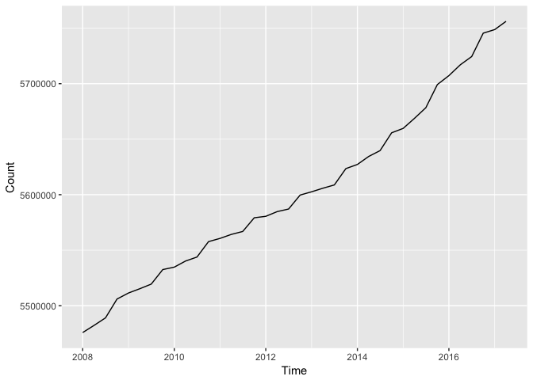

<!-- README.md is generated from README.Rmd. Please edit that file -->
[](https://travis-ci.org/elben10/rdst)

Overview
--------

rdst is a data package, which allows the user to retrieve data from Statistics Denmark through R. The package provide statistics coded in both english as well as danish. This allows users outside Denmark to investigate and explore high quality data.

Installation
------------

``` r
# The only way to get rdst right now is to install the github version using the devtools package. This can be done with the line of code beneath.
devtools::install_github("elben10/rdst")
```

Usage
-----

The aim of the package is to make it easier to access data from Statistics Denmark. To access an overview of the collection of data sets we could use the function `dst_tables()`. It returns a tibble containing information about all data sets available at Statistics Denmark.

``` r
dst_tables()
#> # A tibble: 1,853 x 2
#>       id                                       text
#> *  <chr>                                      <chr>
#> 1 FOLK1A Population at the first day of the quarter
#> 2 FOLK1B Population at the first day of the quarter
#> 3 FOLK1C Population at the first day of the quarter
#> 4 FOLK1D Population at the first day of the quarter
#> 5 FOLK1E Population at the first day of the quarter
#> # ... with 1,848 more rows
```

As default, the function will only return two columns containing a short description of the data set, and the data set's ID. Though, it is possible to get more information about the data set using the column argument. For instance, we could be interested in when some data sets was last updated, or just be interested in new data from Statistics Denmark. To see when a data set most recently was updated we could use the following piece of code.

``` r
dst_tables(columns = c("id", "text", "updated"))
#> # A tibble: 1,853 x 3
#>       id                                       text             updated
#> *  <chr>                                      <chr>               <chr>
#> 1 FOLK1A Population at the first day of the quarter 2017-05-11T09:00:00
#> 2 FOLK1B Population at the first day of the quarter 2017-05-11T09:00:00
#> 3 FOLK1C Population at the first day of the quarter 2017-05-11T09:00:00
#> 4 FOLK1D Population at the first day of the quarter 2017-05-11T09:00:00
#> 5 FOLK1E Population at the first day of the quarter 2017-05-11T09:00:00
#> # ... with 1,848 more rows
```

There is also more information available such as the first and the last period of the data sets. To see all the available columns see [dst\_tables()](https://elben10.github.io/rdst/reference/dst_tables.html)

It is crucial to know which variables is contained in a data set. To that purpose we can use the `dst_variables()` function. If we provide the function with a table ID provided as a charactervector it will return a tibble which has two columns. A column with the variable ID, and column with a short description of the variable. If we are interessted in the population growth in Denmark, we could find, which variables that are contained in the data set *FOLK1A*.

``` r
dst_variables("FOLK1A")
#>           id           text
#> 1     OMRÅDE         region
#> 2        KØN            sex
#> 3      ALDER            age
#> 4 CIVILSTAND marital status
#> 5        Tid           time
```

Now where we know which variables is contained in the data set, we can move forward and begin with the more interesting thing. Getting the data and explore it. To download data from Statistics Denmark we can use the function `dst_download()`. It suprisingly allows us to get data from Statistics Denmark. For instance if we still are interessted in how the danish population has developed recently we could download the data set *FOLK1A*.

``` r
dst_download("FOLK1A")
#> Warning in dst_download("FOLK1A"): No vars is specified. Only time will be
#> included
#> # A tibble: 38 x 2
#>          TID INDHOLD
#>       <date>   <dbl>
#> 1 2008-01-01 5475791
#> 2 2008-04-01 5482266
#> 3 2008-07-01 5489022
#> 4 2008-10-01 5505995
#> 5 2009-01-01 5511451
#> # ... with 33 more rows
```

To illustrate the population growth we could use Hadley Wickham's package `ggplot2` and Stefan Bache's package `magrittr` to enable piping.

``` r
library(ggplot2)
library(magrittr)

dst_download("FOLK1A") %>%
  ggplot(aes(TID, INDHOLD)) +
  geom_line()
#> Warning in dst_download("FOLK1A"): No vars is specified. Only time will be
#> included
```


